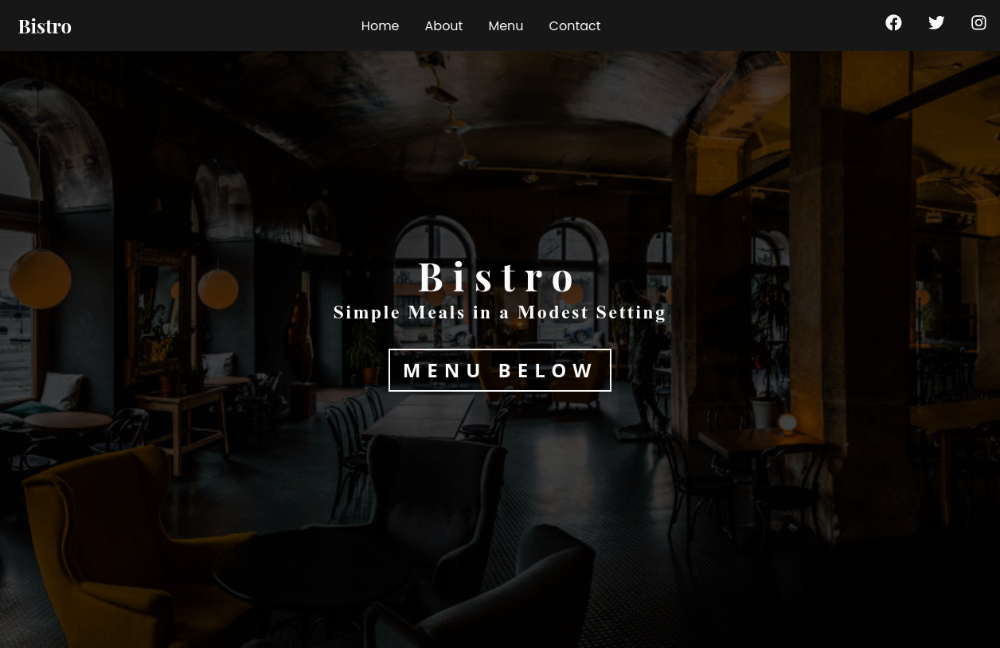

# Bistro

[Bistro](https://amorebistro.netlify.com/) is a rustic restaurant.

It uses [Gatsby](https://www.gatsbyjs.org/) for the frontend and [Contentful](https://www.contentful.com/) as a headless CMS to fetch and populate data.
